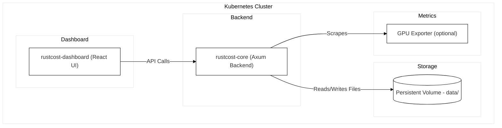

## 🦀 RustCost Helm Chart

Helm chart to deploy **RustCost** — including the **Axum backend (`rustcost-core`)**, optional **React dashboard (`rustcost-dashboard`)**, and optional **node-level metrics collector (Node Exporter)**.

This version removes the PostgreSQL and cAdvisor dependencies in favor of a lightweight file-based persistence layer (`/app/data`) backed by a Kubernetes PersistentVolume (PVC).

---

## Maintainer

- [@songk1992](https://github.com/songk1992)
- [@RyuDK](https://github.com/RyuDK)
- [@HakyungYoun](https://github.com/HakyungYoun)
---

### 🧭 Architecture Overview



---

## 🚀 Features

- **Stateless deployment** for backend (`rustcost-core`)
- **Optional dashboard** (`rustcost-dashboard`) for visualization
- **PVC-backed local storage** (default `/app/data`) — no external DB required
- **Optional Node Exporter** for node-level metrics
- **Ingress-ready** for external exposure
- **Lightweight footprint** — minimal dependencies

---

## 🛠️ Usage

Install [Helm](https://helm.sh/docs/intro/install/) first.

Add the repository:

```bash
helm repo add rustcost https://rustcost.github.io/rustcost-helmchart
helm repo update
```

Search the chart:

```bash
helm search repo rustcost
```

---

## 🧩 Installation Examples

### 1. Default install (backend + PVC)

```bash
helm upgrade --install rustcost rustcost/rustcost \
  -n rustcost --create-namespace --version 1.0.0-dev.16
```

This deploys:

- `rustcost-core` backend (Axum)
- PVC mounted at `/app/data`
- Optional GPU Exporter DaemonSet (disabled by default)

---

### 2. Backend only (no dashboard, no metrics)

```bash
helm install rustcost rustcost/rustcost \
  --namespace rustcost --create-namespace \
  --set dashboard.enabled=false \
  --set gpuExporter.enabled=false
```

---

### 3. Backend + Dashboard (no metrics)

```bash
helm install rustcost rustcost/rustcost \
  --namespace rustcost --create-namespace \
  --set dashboard.enabled=true \
  --set gpuExporter.enabled=false
```

---

### 4. Enable GPU Exporter

```bash
helm install rustcost rustcost/rustcost \
  --namespace rustcost --create-namespace \
  --set gpuExporter.enabled=true
```

---

## 🧪 Development & Testing

You can validate this chart with **helm-unittest**.

Install the plugin:

```bash
helm plugin install https://github.com/helm-unittest/helm-unittest
```

Run tests:

```bash
helm unittest charts/rustcost
```

Expected output:

```
### Chart [ rustcost ] charts/rustcost

 PASS  deployment test            charts/rustcost/tests/deployment_test.yaml
 PASS  snapshot test              charts/rustcost/tests/rustcost_test.yaml

Charts:      1 of 1 passed
Suites:      2 of 2 passed
Tests:       2 of 2 passed
Snapshots:   1 of 1 passed
Time:        29ms
```

---

## 🧱 Notes

- Data is persisted using a PVC (default size: `5Gi`, mount path: `/app/data`).
- PostgreSQL and cAdvisor are **no longer used**.
- GPU Exporter is optional and disabled by default.
- The dashboard (`rustcost-dashboard`) communicates with the backend at `http://rustcost-core:80`.
- No external database or Prometheus is required.

---

## 🔮 Future Plans

1. **Pluggable storage backends** (e.g. SQLite, S3, local FS)
2. **Configurable retention policies**
3. **Anomaly detection and forecasting**
4. **Enhanced dashboard UX and alerting**
5. **Public documentation site and examples**

---

## 🌐 Related

- [RustCost Project](https://github.com/rustcost)
- [Docker Hub – core](https://hub.docker.com/repository/docker/rustcost/core)
- [Docker Hub – dashboard](https://hub.docker.com/repository/docker/rustcost/dashboard)
- [Docker Hub – gpu-exporter](https://hub.docker.com/repository/docker/rustcost/gpu-exporter)

---
