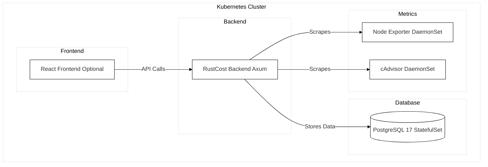

# RustCost Helm Chart

Helm chart to deploy **RustCost** (Axum backend) with optional **React frontend**, **PostgreSQL 17**, and node-level metrics collectors (**node-exporter** + **cAdvisor**).

---

## Maintainer

- @songk1992

---



---

### ROADMAP / TODO

RustCost is an evolving project. While the current Helm chart provides a functional deployment of the backend, optional frontend, PostgreSQL, and node-level collectors, there are several areas we aim to explore and improve over time:

1. **Lightweight storage options**  
   Replace PostgreSQL as the primary persistence layer with a lightweight file-based system that uses minimal memory/CPU

2. **Secure and efficient metrics collection**  
   Explore replacing or complementing cAdvisor and node exporter with a Rust-native metrics exporter to improve security, reduce dependencies, and simplify integration.

3. **Intelligent reporting & alerting**  
   Add cost anomaly detection, forecasting, and alerting using AI/ML techniques to provide actionable FinOps insights out of the box.

4. **Landing page & docs site**  
   Build a clean landing page (e.g., GitHub Pages or a static site) that introduces RustCost, explains use cases, and guides new users with quickstart docs, architecture diagrams, and community links.

5. **Data retention policy**  
   Add configurable retention (e.g., delete data older than N days, default 30) to prevent unbounded growth of metrics tables/logs and keep memory/CPU usage predictable.

---

## Usage

Install [Helm](https://helm.sh/docs/intro/install/) first.

Add the repository:

```bash
helm repo add rustcost https://rustcost.github.io/rustcost-helmchart
helm repo update
```

Search the chart:

```bash
helm search repo rustcost
```

---

## Installation Examples

### 1. Default install (backend + Postgres + metrics)

```bash
helm repo add rustcost https://rustcost.github.io/rustcost-helmchart/
helm repo update
helm upgrade --install rustcost rustcost/rustcost -n rustcost --create-namespace
```

This deploys:

- RustCost backend (Axum)
- PostgreSQL 17 (with `rustcost` DB created)
- Migration Job (`rustcost migrate`)
- Node Exporter (DaemonSet)
- cAdvisor (DaemonSet)

---

### 2. Using an external PostgreSQL

Disable bundled Postgres and supply your own secret/connection:

```bash
helm install rustcost rustcost/rustcost \
  --namespace rustcost --create-namespace \
  --set postgresql.enabled=false \
  --set postgresql.existingSecret=my-db-secret
```

The secret should contain a `DATABASE_URL`.

---

### 3. Backend only (no DB, no metrics)

```bash
helm install rustcost rustcost/rustcost \
  --namespace rustcost --create-namespace \
  --set postgresql.enabled=false \
  --set frontend.enabled=false \
  --set nodeExporter.enabled=false \
  --set cadvisor.enabled=false
```

---

### 4. With React frontend

```bash
helm install rustcost rustcost/rustcost \
  --namespace rustcost --create-namespace \
  --set frontend.enabled=true \
  --set frontend.image.repository=kimc1992/rustcost-frontend \
  --set frontend.image.tag=latest
```

---

## Development & Testing

You can validate this chart with **helm-unittest**.

Install the plugin:

```bash
helm plugin install https://github.com/helm-unittest/helm-unittest
```

Run tests from repo root:

```bash
helm unittest charts/rustcost
```

Expected output:

```
### Chart [ rustcost ] charts/rustcost

 PASS  deployment test            charts/rustcost/tests/deployment_test.yaml
 PASS  snapshot test              charts/rustcost/tests/rustcost_test.yaml

Charts:      1 of 1 passed
Suites:      2 of 2 passed
Tests:       2 of 2 passed
Snapshots:   1 of 1 passed
Time:        29ms
```

---

## Notes

- PostgreSQL defaults to **17.x** (official Docker Hub image).
- If Postgres is enabled, the chart creates a `rustcost` database and runs migrations automatically.
- Node Exporter (v1.8.1) and cAdvisor (v0.49.1) are deployed by default.
- RustCost scrapes metrics directly from node-exporter and cAdvisor (no Prometheus required).

---

## Related

- [RustCost Project](https://github.com/rustcost)
- [Docker Hub – RustCost](https://hub.docker.com/repository/docker/kimc1992/rustcost/general)
- [Docker Hub – PostgreSQL](https://hub.docker.com/_/postgres)
- [Node Exporter](https://github.com/prometheus/node_exporter)
- [cAdvisor](https://github.com/google/cadvisor)

```

```
